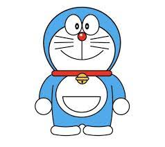

# 마크다운 연습
> Heading은 #

> #의 개수에 따라 제목의 수준을 구별

[toc]

## 제목 2
### 제목 3
#### 제목 4
---
---
## 리스트
1. 순서가
    1. 있는
    2. 리스트

- 순서가
    - 없는
    - 리스트
        - 안쪽의 안쪽
        1. 다시 순서가
        2. 있는 리스트
---
---
## 코드
print('hello, world')
```python
 print('hello, world')
```
```javascript
console.log('hello')
```

- 문장 작성시 줄글로 작성한다.
- 줄글로 작성한 문장 내에서
- 코드를 설명해야 한다면?
- `print`문은 그렇게 쓰는거 아니야.
---
---
## 이미지와 링크
> 절대 경로 | C/Users/SSAFY/Desktop/study/startcamp02

> 상대 경로 | ../ssafy.png

[파이썬 내장 함수](https://docs.python.org/3/library/functions.html)


---
---
## 기본적인 텍스트 스타일 관리
~~ 취소선 ~~

*기울임*

**굵게**
---
~~  테이블 ~~

>월요일 : 시험
종류 -> 과목평가 객주서 : 1시간

---
> 2시간 짜리 시험

> 코드베이스 과목평가(알고리즘, 디버깅)        
>  코드베이스 월말평가

---
*11시부터 1시까지*
교재 기반 내용 복습

- 과제는 진도 나가는 날은 매일 있음
과제는 1~2개 정도의 문제이고
난이도는 라이브 수업 들으면 풀어짐

- 실습은 매일 8개 실습 -> 다못풀면 집가서 푸셈

## 과제
- 과제 제출을 안하면 면담 맞음
- 취업 시, 깐깐한 회사는 레퍼런스 체크 요구
- 